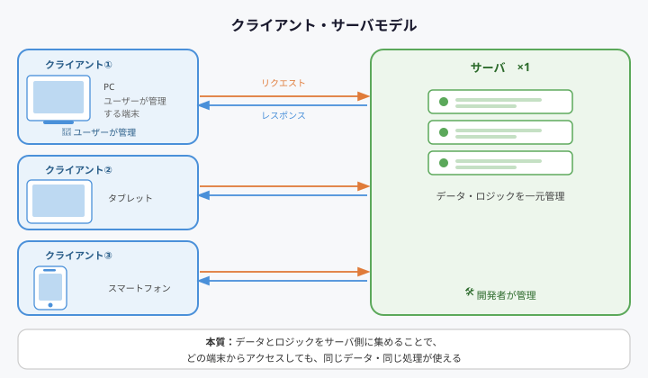
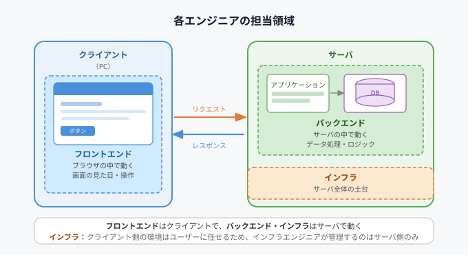
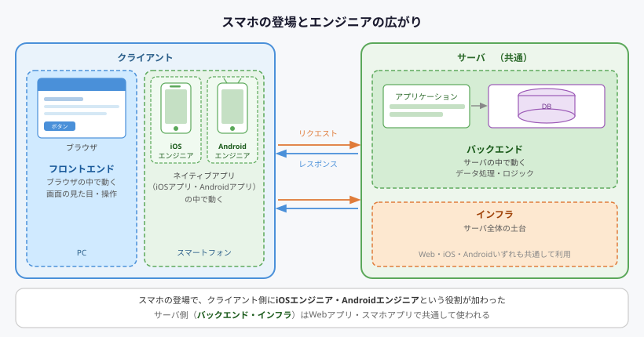

## エンジニアの役割概要

#### 0. クライアント・サーバモデル

前提として、Webアプリケーション（＝Webサービス／Webシステム）は、「クライアント・サーバモデル」で構築されている
- Webアプリケーション：Webブラウザを使って操作するアプリケーション
- クライアント・サーバモデル：無数のクライアント端末（PC・タブレット・スマートフォン）が、1つのサーバと通信する仕組み

---

#### 1. 各エンジニアの担当領域

各領域で求められる専門性に応じて、役割の異なるエンジニアが存在する

---

#### 2. スマホの登場とエンジニアの広がり

スマートフォンの普及により、クライアント側にiOSエンジニア・Androidエンジニアという役割が加わる

